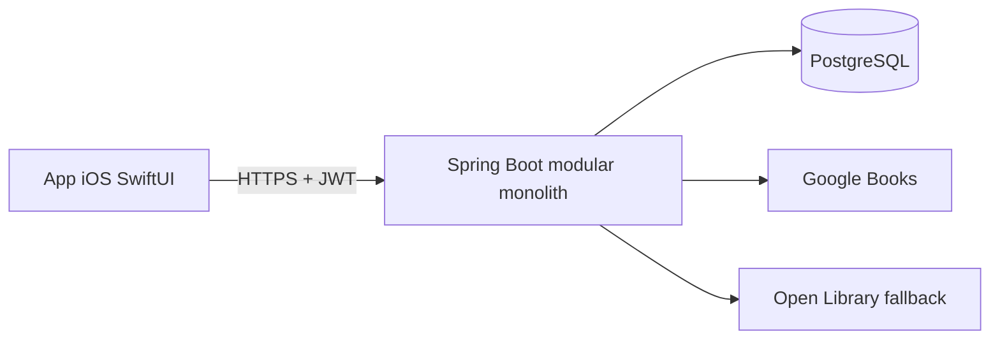

# Arquitetura

## Visão geral

## Backend

Cada módulo possui domínio independente de framework, casos de uso em `application`, adapters JPA/HTTP em `infrastructure` e controllers em `web`. Chamadas são transacionais no limite da aplicação. Flyway é a única autoridade de schema. JWT access tokens são curtos; refresh tokens e tokens de recuperação são armazenados apenas como SHA-256 e podem ser revogados.

Catálogo consulta a base local primeiro, Google Books como fonte primária e Open Library como fallback. Respostas são normalizadas, deduplicadas e persistidas. Caffeine evita repetir buscas; os adapters têm timeout de conexão/leitura e uma repetição limitada.

## iOS

O `AppContainer` injeta protocolo de cliente HTTP, armazenamento de tokens e relógio. Cada feature contém View, ViewModel e modelos de apresentação. ViewModels são `@MainActor`, usam estados explícitos e chamam a API com `async/await`. SwiftData preserva livros e snapshots úteis para leitura; Keychain guarda tokens.

O timer deriva o tempo decorrido de `startedAt`, não de contadores em memória. Isso mantém o resultado correto após suspensão. `ReadingActivityManaging` isola ActivityKit para ativação com entitlement posterior.

## Segurança e privacidade

- Autorização por proprietário em mutações de biblioteca, sessão, nota, review e publicação.
- Notas privadas e posts privados são filtrados no servidor.
- CORS e segredos são configuráveis por ambiente.
- Erros seguem `application/problem+json`; validações não expõem internals.
- Bloqueio e denúncia fazem parte do MVP.

